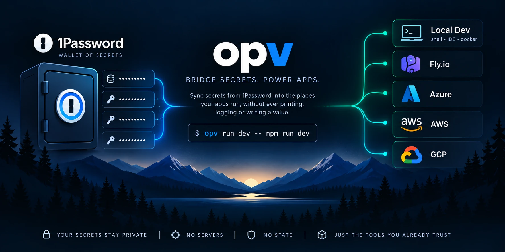

<p align="center">
  
</p>

# opv

[](https://github.com/matt-cochran/1password-vault/actions/workflows/ci.yml)
[](https://github.com/matt-cochran/1password-vault/releases/latest)
[](LICENSE)
[](Cargo.toml)

Sync secrets from 1Password into the places your apps run, without ever printing, logging or writing a value.

1Password owns the values. Your runtime consumes them. `opv` connects the two and nothing else: no server, no state, no encryption of its own, and no command that prints a secret. What to sync is a small configuration of IDs, key names and validation rules, never values, kept in 1Password next to the secrets or in a committed `secrets.toml`.

## Quick start

Install on Linux or macOS ([other ways](docs/install.md)):

```sh
curl -fsSL https://raw.githubusercontent.com/matt-cochran/1password-vault/main/install.sh | sh
```

In a checkout of a project whose configuration lives in 1Password, no file is needed:

```sh
opv login dev                    # sign in to dev's 1Password account (your own terminal)
opv run dev -- npm run dev       # your app, with dev's settings as environment variables
```

opv finds the configuration by the repository's git remote, and `op run` resolves the values, so nothing lands on disk. Starting a project instead: `opv init dev --vault <vault> --item <item>` writes the configuration from an existing 1Password item ([configuration](docs/configuration.md#start-from-an-existing-item-opv-init)), and `opv setup` walks a person through a project that ships a setup recipe ([guided setup](docs/guided-setup.md)).

Then, for a deployed environment:

```sh
opv status prod                  # one row per key, problems first
opv plan prod                    # what a sync would write, hold and prune, and its plan id
opv sync prod --deploy --expect-plan 412a5b23   # exactly that plan, then deploy
```

```console
$ opv status prod
prod: 2 keys · 0 saved · 0 skipped · 2 findings · 0 not yet on Fly
PRODUCT  KEY             KIND    STATE                                             TARGET
api      LOG_LEVEL       config  failed enum (expected one of: debug, info, warn)  n/a
    open: https://start.1password.com/open/i?a=ACCOUNTID&v=vprd&i=iprd&h=my.1password.com (section api, field LOG_LEVEL)
api      OPENAI_API_KEY  secret  missing                                           unknown
    guidance: OpenAI platform / API keys
    open: https://start.1password.com/open/i?a=ACCOUNTID&v=vprd&i=iprd&h=my.1password.com (section api, field OPENAI_API_KEY)
unknown: Fly does not reveal stored values, so opv cannot compare them; sync stages them and compares digests (opv help states)
opv: 2 findings
Do: fix the keys above in 1Password
Next: opv open api/LOG_LEVEL --env prod
```

Problems come first, each with its reason and a link to its item in 1Password, the only place a value is typed. Every failure ends with one runnable `Next:` command.

## Why

- **Values stay out of your tooling.** They travel only on stdin to the official `op` and target CLIs, or in your app's environment: never in argv, files, logs, errors or CI output.
- **Typed and checked before they ship.** Each key declares its kind (secret or config) and rules (`prefix`, `base64_bytes`, `enum`, `https_url`, ...). A bad value fails `status` with the key, the rule and a reason, never the value.
- **Explicit, never surprising.** No prompts in automation. Nothing is deployed without `--deploy`, nothing is deleted without `--prune`, and prune only touches names opv manages.
- **Safe to re-run.** Reads are retried, writes are checked, and an interrupted run converges when you run it again ([how opv handles failures](docs/how-opv-handles-failures.md)).
- **Built for scripts and assistants.** `--json` on every reporting command, stable error codes, and `opv schema` describing the installed binary.

## Targets

| Target | Status |
|---|---|
| Fly.io | supported |
| Azure Key Vault + Container Apps | supported |
| Kubernetes (Secrets + Deployment) | supported |
| Azure Key Vault → Kubernetes (External Secrets Operator) | supported |
| Azure App Service | planned ([#40](https://github.com/matt-cochran/1password-vault/issues/40)) |
| AWS (Secrets Manager + ECS) | planned ([#41](https://github.com/matt-cochran/1password-vault/issues/41)) |
| GCP (Secret Manager + Cloud Run) | planned ([#42](https://github.com/matt-cochran/1password-vault/issues/42)) |

Each environment names one target, and every command is the same for all of them ([configuration](docs/configuration.md#targets)). On Azure and Kubernetes a secret is written as a new version and the app keeps the old one until `sync --deploy`. Local development needs no target at all.

## Documentation

- [Installing](docs/install.md): install script, binaries, npm, source, verifying downloads, prerequisites.
- [Configuration](docs/configuration.md): where the configuration lives, the schema, store layout, every target, shared keys, `init` and `add`, rules.
- [Local development](docs/local-development.md): `opv run`, `opv check`, several products, WSL.
- [Guided setup](docs/guided-setup.md): `opv login` and `opv setup` for people.
- [Usage](docs/usage.md): every command and flag, the JSON contract, exit codes, GitHub Actions, security model.
- [How opv handles failures](docs/how-opv-handles-failures.md): retries, time limits, exit 9, `Next:`, interruptions.
- [Setting up with an AI assistant](docs/agent-setup.md) (also `opv guide agent`) and [llms.txt](llms.txt).
- [Design](docs/design/) for contributors, and the [changelog](CHANGELOG.md).

## Security

Values are held in redacting, zeroizing types and travel only on stdin or in a child process's environment. When a CLI fails, its last few stderr lines are shown with every known value and secret-shaped token masked as `__SECRET__`. `config export` prints config-kind values by design, and `run` hands secrets to the process you start. The full model and its limits are in [usage](docs/usage.md#security-model-and-limits).

Report vulnerabilities privately as described in [SECURITY.md](SECURITY.md), not in a public issue.

## Contributing

Contributions are welcome. [CONTRIBUTING.md](CONTRIBUTING.md) covers the checks, the branch flow and the secret-safety rules every change must keep. This project follows the [Contributor Covenant](CODE_OF_CONDUCT.md).

The repository is named `1password-vault` for historical reasons; the tool is `opv`. It borrows its workflow from [significa/1password-secrets](https://github.com/significa/1password-secrets) and none of its code; the behaviours it deliberately rejects are listed in the [requirements](docs/design/requirements.md).

## License

[MIT](LICENSE)
